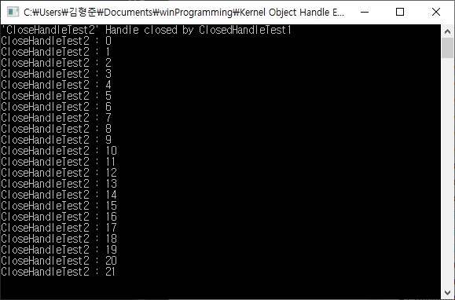
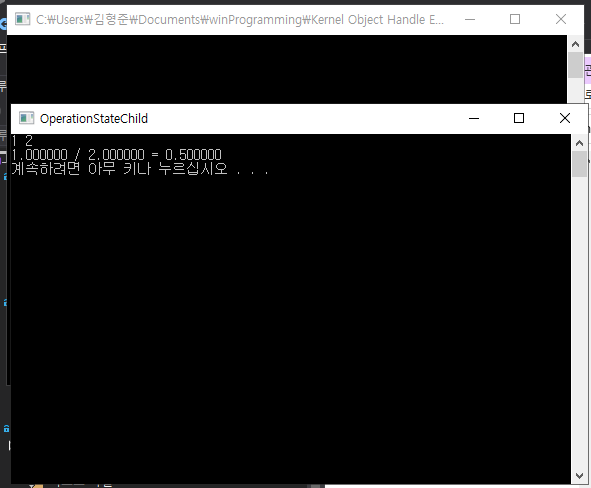
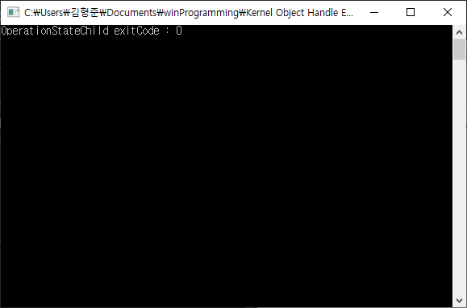

# Kernel Object HANDLE Ex
---
## < 프로세스 우선순위 변경 >
<b>- 프로세스, 스레드, 파일 등의 리소스들을 관리하기 위한 Kernel Object</b>

	- Kernel Object : 커널에서 관리하는 중요한 정보를 담아둔 데이터 블록
	- Kernel Object는 직접적으로 접근이 불가능 (윈도우 운영체제에서 관리)
	- Kernel Object는 종류에 따라 다른 구조체 형태로 생성
	- Kernel Object 조작을 위하여 운영체제애서 HANDLE을 통하여 간접적으로 접근이 가능하도록 API 제공

	ex)
		파일의 Kernel Object : 속성(Read, Write, Read&Write) 등의 정보 저장
		프로세스 Kernel Object : 프로세스 스케줄링을 위한 우선순위 정보 등

	---

	- HANDLE : winnt.h에 void* 로 정의 된 Kernel Object가 생성 시 마다 윈도우가 할당하는 일련의 고유 숫자로서, HANDLE을 통해 해당 Kernel Object에 접근
	- HANDLE (HANDLE 테이블)은 운영체제에 종속적이지 않고 프로세스에 종속적

	HANDLE			Kernel Object 			Resource
	Pipe HANDLE	<->	Pipe Kernel Obj		<->	Pipe
	Process HANDLE	<->	Process Kernel Obj	<->	Process
	Thread HANDLE	<->	Thread Kernel Obj	<->	Thread
	etc..

 

<b><u>Fig 1) 프로세스 스케줄링 테스트 결과</u></b>

	1) 'PriortyTest1' 과 'PriorityTest2' 를 단일 코어 실행 환경에서만 작동하도록 설정
	(다중 코어로 작동 시킬 경우 병렬 처리에 의해 우선순위 테스트가 제대로 불가능)
	2) 'PriorityTest1' 는 'PriorityTest2'를 실행
	3) 'PriorityTest2' 는 자신을 높은 프로세스 우선순위로 변경
	4) 'PriorityTest1' 과 'PriorityTest2' 는 각각 화면에 출력하기 위한 작업을 수행
	5) 위 Fig 1) 프로세스 스케줄링 테스트 결과에 따라, 프로세스 스케줄링에 의해 'Priority1' 은 'Priority2' 보다 우선순위가 낮으므로, 거의 할당 받지 못함

---
## < Kernel Object와 HANDLE의 종속 관계 >
<b>- Kernel Object는 Windows 운영체제에 종속적</b>

	- Kernel Object의 소멸 시점은 운영체제에 의해 결정
	- Kernel Object는 프로세스에 종속되어 있지 않으므로, 여러 프로세스에 의해 접근 가능
	(단, API 호출을 통한 간접 접근)
	
<b>- HANDLE은 운영체제에 종속적이지 않고, 프로세스에 종속적</b>

	(PROCESS_INFORMATION 구조체)
	https://docs.microsoft.com/en-us/windows/win32/api/processthreadsapi/ns-processthreadsapi-process_information

	- 프로세스 핸들 (hProcess) : 프로세스의 Kernel Object를 가리키기 위한 것
	- 프로세스 ID (dwProcessId) : 프로세스 간 구분을 위한 ID
	- 쓰레드 핸들 및 ID (hThread, dwThreadId) : 프로세스 내부적으로 경량 프로세스(쓰레드)를 위한 핸들 및 ID 

 

<b><u>Fig 2) Handle을 통한 Kernel Object 접근 및 테스트 결과 1</u></b>

	1) 'KernelObjShare' 은 'PriorityTest2' 를 실행 (단일 코어 실행 환경)
	2) 'PriorityTest2' 는 자신을 높은 프로세스 우선순위로 변경 (최초 한 번)
	3) 'KernelObjShareEx' 는 Busy Waiting 후 'PriorityTest2' 의 우선순위를 기존 우선순위로 낮춤
	4) 위 Fig 2) Handle을 통한 Kernel Object 접근 및 테스트 결과 1에 따라, 프로세스 스케줄링에 의해 동일한 우선순위를 가지므로, 번갈아 가며 작업을 수행함

 

<b><u>Fig 3) Handle을 통한 Kernel Object 접근 및 테스트 결과 2</u></b>

    1) 'CloseHandleTest1' 은 'CloseHandleTest2' 를 실행
    2) 'CloseHandleTest1' 는 'CloseHandleTest2' 프로세스가 종료되기 전 'CloseHandleTest2' 핸들 반환
    3) 위 Fig 3) Handle을 통한 Kernel Object 접근 및 테스트 결과 2에 따라, 핸들을 운영체제에 반환하였지만 'CloseHandleTest2' 프로세스는 자신의 작업을 모두 마치고 소멸함
    4) 즉, 핸들을 반환한다고 해서 Kernel Object가 소멸되지 않았음을 의미함

---
## < Kernel Object와 Usage Count >
<b>- Windows 운영체제의 Kernel Object 소멸 시기 결정</b>

    - 앞서 Kernel Object의 소멸 시점은 운영체제에 의해 결정된다고 하였을 때, 프로세스가 종료 시 해당 프로세스에 관련 된 Kernel Object가 동시에 소멸되는가?
    - 자식 프로세스가 종료될 때 Kernel Object도 동시에 소멸될 시 부모 프로세스는 자식 프로세스의 종료 코드를 얻을 수 없다.
    - Windows가 Kernel Object 소멸시기를 결정 시 해당 Kernel Object를 참조하는 대상 시 하나도 없을 때 소멸시킨다.
	
	---
	
    - Usage Count : Kernel Object 소멸시기를 결정 짓기 위한 참조 횟수
    - Kernel Object에 접근 가능한 HANDLE 개수가 증가함에 따라 Usage Count도 증가
    - 더 이상 Kernel Object를 참조하는 프로세스가 존재 하지 않을 시(Usage Count = 0) 해당 Kernel Object 소멸

 

 

<b><u>Fig 4) Handle을 통한 Kernel Object 접근 및 테스트 결과 3</u></b>

	1) 부모 프로세스인 'OperationStateParent' 는 자식 프로세스인 'OperationStateChild' 를 실행
	(CreateProcess 시점에 부모 프로세스는 자식 프로세스 Kernel Object 접근을 위한 HANDLE을 얻으며, 자식 프로세스는 자기 자신의 Kernel Object를 참조하므로 자식 프로세스 생성 시점에 자식 프로세스의 Usage Count : 2)
	2) 'OperationStateChild' 는 사용자로부터 입력을 받아 연산 수행 후 화면에 출력 및 작업상태 반환
	3) 'OperationStateParent' 는 'OperationStateChild' 가 종료 시 까지 대기 후 작업 상태 출력
	(자식 프로세스인 'OperationStateChild' 가 종료 되었지만, 부모 프로세스인 'OperationStateParent'가 Handle을 통해 자식 프로세스에 대한 커널 오브젝트를 아직 참조중이므로, Usage Count = 1 이 후, Handle 반환 시 Usage Count = 0)
	
---
